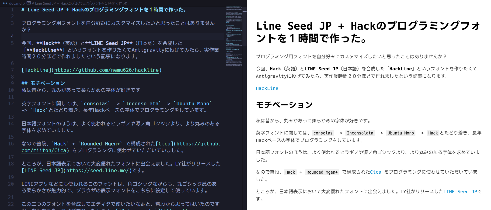

## 概要


プログラミング用フォントを自分好みにカスタマイズしたいと思ったことはありませんか？

今回、**Hack**（英語）と**LINE Seed JP**（日本語）を合成した「**HackLine**」というフォントを作りたくてAntigravityに投げてみたら、コーディング0行、実作業時間20分ほどで作れましたという記事になります。

[**HackLine**](https://github.com/nemu626/hackline)

## モチベーション

私は昔から、丸みがあって柔らかめの字体が好きです。

英字フォントに関しては、`consolas` -> `Inconsolata` -> `Ubuntu Mono` -> `Hack`とたどり着き、長年**Hack**ベースの字体でプログラミングをしています。

日本語フォントのほうは、よく使われる**ヒラギノ**や**源ノ角ゴシック**より、より丸みのある字体を求めていまして、**M+** 系のフォントを主に使用していました。

そして近年、日本語表示において大変優れたフォントに出会えました。LY社（当時LINE社)がリリースした[**LINE Seed JP**](https://seed.line.me/)です。

LINEアプリなどにも使われるこのフォントは、角ゴシックながらも、丸ゴシック感のある柔らかさが魅力的で、私の所属組織と関りがあることもあり、かなり愛着を持って使っています。
ここ二年ほどはブラウザのデフォルト表示フォントをこれにしています。

この二つのフォントを合成してコンソールで使いたいなぁと、普段から思ってはいたのですが、自分で作るのもハードルが高そうだったので、普段は`Hack` + `Rounded Mgen+` で構成された[**Cica**](https://github.com/miiton/Cica) をプログラミングに使わせていただいていました。

(LINE Seed JP系のプログラミングフォントとして、`HackGen`や`PlemolJP`で著名なyuru7氏による、[**juisee**](https://github.com/yuru7/juisee)があるのですが、どうしても慣れ親しんだHack Fontを手放せなかったのです・・・)

なかなかきっかけがなかったところ、[Antigravity](https://antigravity.google/)の自走能力がなかなかのものだったので、実力テストを兼ねて作らせてみました。

## やったこと

（以下投げたプロンプトとAgentのアクション）

#### Step 1

```
Prompt:
https://github.com/yuru7/HackGen
を参考に、Hack fontと、LINE Seed JPを合成させたフォントを作ろうと思います。
```

- Agentが行ったアクション
  - Hack, Line Seed JPのダウンロード
  - Hackgen RepoのClone
  - Merge Scriptの作成(`merge_fonts.py`)
  - 実際に動くフォントの合成(`/build/HackLine-Regular.ttf`)

#### Step 2

```
gitignoreを設定してください。また、適切なライセンスファイルも作成してください。
```

- `README.md`の作成
- `.gitignore`の作成
- `LICENSE`の作成

#### Step 3

```
では、NerdFont対応もお願いします。HackGenを参考にお願いします。
```

- Nerd Font Patcherのダウンロード
- Nerd Font対応のフォントの合成(`HackLineNF-Regular.ttf`, `HackLineNF-Bold.ttf`)

ここで、フォントのダウンロードなどの手順がREADMEに書かれていたため、バッチスクリプトにします。

#### Step 4

```
readmeに書かれているビルド手順を自動化するシェルスクリプトを書いて
```
- `build.sh`の作成

#### Step 5

```
github.comのリリースにHackLine-*.ttfをまとめたzipを成果物としてアップロードする仕組みを作ってください。
```

- github actionの設定(`.github/workflows/release.yml`)

Agentに指示されたとおりに1.0.0のタグをPushしたところ、Workflowが失敗しています。

#### Step 6

```
以下のエラーでWorkflowが失敗しました。
（以下エラーStack）

https://github.com/nektos/act を使って、
workflowをローカルで実行しながらデバッグしてくれないか？
```

- Workflowの修正
- `nektos/act`のインストール
- `act`によるWorkflowのテスト

#### 1.0.0 Release

ここまでで、**HackLine-1.0.0**がリリースされました。

しかし、実際にインストールして使ってみたところ、**一部のコンソール向けGlyph**(`  `など)が正常に表示されないことが分かりました。
なのでこちらを修正します。

#### Step 7

```
 (Linuxのペンギン)が表示されなかった。なぜだろう？
```

- FontPatcherによるPatchではなく、HackNerdFontから合成する手法への切り替え
- HackNerdFontのダウンロード
- ビルドスクリプトの修正

#### 1.0.1 Release (← Now!)

ここまでで1.0.1 tagをPushしたところ、無事にコンソール向けGlyphを含む**HackLine-1.0.1**がGithub上でビルドされ、リリースされました。

## まとめ


- 早速エディタやターミナルのフォントに指定して使っていますが、かなり満足しています。
- 今後の改善事項
  - 全角スペースを点線で表示する
  - `->`を`⇒`にリガチャするなど

## Antigravityの所感

- Gemini CLIは実装能力が不足していて失望していたのですが、AntigravityはAgent管理のたやすさ、Project全体の管理しやすさ、自走能力など、かなり素晴らしいと思います。
  - `Vscode` + `Github Copilot`や、`Cursor`に比べても遜色ない開発経験が得られますね。
- Google One Proを年間契約したので、上限いっぱい使い倒していきたいと思います。
- 一方、`Gemini 3.0 Pro Preview`モデルそのものに関しては、`Claude Opus 4.5`と比べると、自走能力も正確度も劣っているように思います。
  - 現在、Antigravity内でGeminiもClaudeも選べますが、今後Geminiのみになったら開発用途としてきついかも
